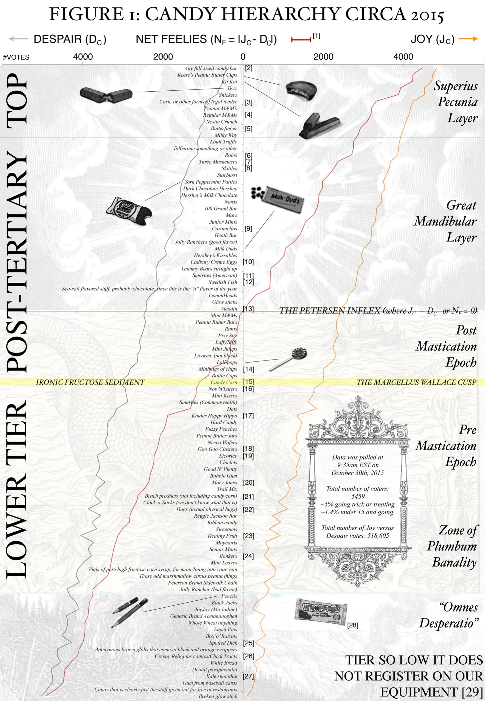

## 2015 Candy Hierarchy

Benjamin Cohen and David Ng have been conducting a Halloween candy survey for a 
couple of years and writing it up:

  * The Candy Hierarchy 2015: your essential guide to Hallowen treats:  
    <http://boingboing.net/2015/10/31/the-candy-hierarchy-2015-your.html>
  * 2015 CANDY HIERARCHY: SUPPLEMENTAL RAW DATA AND NEW ANALYSES:  
    <http://www.scq.ubc.ca/2015-candy-hierarchy-supplemental-raw-data-and-new-analyses/>
  * 2015 data as a Google Sheet:  
    <https://docs.google.com/spreadsheets/d/1REZvjqv0lj3dEYb0CsGyDXkXrjhJ4izlAEImgaufjCc/pubhtml>
  * STRATIGRAPHICAL ANALYSIS OF FRIDAY-SUNDAY IDENTIFICATION IN RELATION TO SUGAR 
CONSUMPTION PREFERENCES AND RELATED DEMOGRAPHIC VARIABLES:  
    <http://www.scq.ubc.ca/stratigraphical-analysis-of-friday-sunday-identification-in-relation-to-sugar-consumption-preferences-and-related-demographic-variables/>
  * The Candy Hierarchy, 2014:  
    <http://boingboing.net/2014/10/31/the-candy-hierarchy-2014.html>
  * CANDY HIERARCHY 2014: SUPPLEMENTARY RAW DATA:  
    <http://www.scq.ubc.ca/candy-hierarchy-2014-supplementary-raw-data/>

This year in [STAT545](http://stat545-ubc.github.io) were going to use this as 
our final challenge in data cleaning, wrangling, and exploration As we make 
progress ... who knows? Maybe this will become a proper data package? Maybe 
we'll make a gallery of visualizations? I have no idea where this is going. For 
now, I'm just parking the raw data in [data-raw](data-raw) for the students to 
work on in class and for homework.

Here's a visualization from Cohen and Ng ... wonder what we will come up with?

