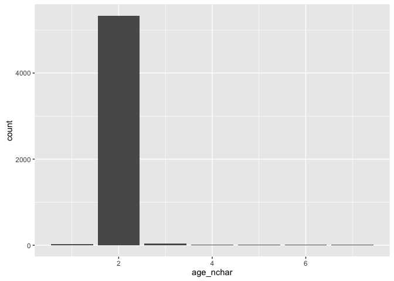

# Getting you started with the candy data
Jenny Bryan  
`r format(Sys.Date())`  
I'm putting the cleaning done during class plus a bit more here, in case it's
helpful to you re: homework 7.


```r
library(readr)
suppressPackageStartupMessages(library(dplyr))
library(tidyr)
library(stringr)
library(ggplot2)

raw <- read_csv("CANDY-HIERARCHY-2015 SURVEY-Responses.csv",
                col_types = cols(
                  Timestamp = col_datetime("%m/%d/%Y %H:%M:%S")
                ))
raw
```

```
## Source: local data frame [5,658 x 124]
## 
##              Timestamp How old are you?
##                 (time)            (chr)
## 1  2015-10-23 08:46:20               35
## 2  2015-10-23 08:46:52               41
## 3  2015-10-23 08:47:34               33
## 4  2015-10-23 08:47:59               31
## 5  2015-10-23 08:48:12               30
## 6  2015-10-23 08:49:07               38
## 7  2015-10-23 08:50:09               48
## 8  2015-10-23 08:52:14               39
## 9  2015-10-23 08:52:22            9E+22
## 10 2015-10-23 08:53:31               54
## ..                 ...              ...
## Variables not shown: Are you going actually going trick or treating
##   yourself? (chr), [Butterfinger] (chr), [100 Grand Bar] (chr), [Anonymous
##   brown globs that come in black and orange wrappers] (chr), [Any
##   full-sized candy bar] (chr), [Black Jacks] (chr), [Bonkers] (chr),
##   [Bottle Caps] (chr), [Box’o’ Raisins] (chr), [Brach products (not
##   including candy corn)] (chr), [Bubble Gum] (chr), [Cadbury Creme Eggs]
##   (chr), [Candy Corn] (chr), [Vials of pure high fructose corn syrup, for
##   main-lining into your vein] (chr), [Candy that is clearly just the stuff
##   given out for free at restaurants] (chr), [Cash, or other forms of legal
##   tender] (chr), [Chiclets] (chr), [Caramellos] (chr), [Snickers] (chr),
##   [Dark Chocolate Hershey] (chr), [Dental paraphenalia] (chr), [Dots]
##   (chr), [Fuzzy Peaches] (chr), [Generic Brand Acetaminophen] (chr), [Glow
##   sticks] (chr), [Broken glow stick] (chr), [Goo Goo Clusters] (chr),
##   [Good N' Plenty] (chr), [Gum from baseball cards] (chr), [Gummy Bears
##   straight up] (chr), [Creepy Religious comics/Chick Tracts] (chr),
##   [Healthy Fruit] (chr), [Heath Bar] (chr), [Hershey’s Kissables] (chr),
##   [Hershey’s Milk Chocolate] (chr), [Hugs (actual physical hugs)] (chr),
##   [Jolly Rancher (bad flavor)] (chr), [Jolly Ranchers (good flavor)]
##   (chr), [Kale smoothie] (chr), [Kinder Happy Hippo] (chr), [Kit Kat]
##   (chr), [Hard Candy] (chr), [Lapel Pins] (chr), [LemonHeads] (chr),
##   [Licorice] (chr), [Licorice (not black)] (chr), [Lindt Truffle] (chr),
##   [Lollipops] (chr), [Mars] (chr), [Mary Janes] (chr), [Maynards] (chr),
##   [Milk Duds] (chr), [LaffyTaffy] (chr), [Minibags of chips] (chr),
##   [JoyJoy (Mit Iodine)] (chr), [Reggie Jackson Bar] (chr), [Pixy Stix]
##   (chr), [Nerds] (chr), [Nestle Crunch] (chr), [Now'n'Laters] (chr),
##   [Pencils] (chr), [Milky Way] (chr), [Reese’s Peanut Butter Cups] (chr),
##   [Tolberone something or other] (chr), [Runts] (chr), [Junior Mints]
##   (chr), [Senior Mints] (chr), [Mint Kisses] (chr), [Mint Juleps] (chr),
##   [Mint Leaves] (chr), [Peanut M&M’s] (chr), [Regular M&Ms] (chr), [Mint
##   M&Ms] (chr), [Ribbon candy] (chr), [Rolos] (chr), [Skittles] (chr),
##   [Smarties (American)] (chr), [Smarties (Commonwealth)] (chr),
##   [Chick-o-Sticks (we don’t know what that is)] (chr), [Spotted Dick]
##   (chr), [Starburst] (chr), [Swedish Fish] (chr), [Sweetums] (chr), [Those
##   odd marshmallow circus peanut things] (chr), [Three Musketeers] (chr),
##   [Peterson Brand Sidewalk Chalk] (chr), [Peanut Butter Bars] (chr),
##   [Peanut Butter Jars] (chr), [Trail Mix] (chr), [Twix] (chr), [Vicodin]
##   (chr), [White Bread] (chr), [Whole Wheat anything] (chr), [York
##   Peppermint Patties] (chr), Please leave any remarks or comments
##   regarding your choices. (chr), Please list any items not included above
##   that give you JOY. (chr), Please list any items not included above that
##   give you DESPAIR. (chr), Guess the number of mints in my hand. (chr),
##   Betty or Veronica? (chr), Check all that apply: "I cried tears of
##   sadness at the end of ____________" (chr), and 22 more (...).
```

```r
#glimpse(raw)
nrow(raw)
```

```
## [1] 5658
```

```r
ncol(raw)
```

```
## [1] 124
```

Create an ID variable for each survey respondent. Bring that variable to the
front. Rename "How old are you?" to `age` and make it the second variable.


```r
raw_with_id <- raw %>%
  mutate(id = sprintf("ID%04d", row_number())) %>%
  select(id,
         age = starts_with("How"),
         everything())
```

Clean `age`. I only expect two characters and they should coerce nicely to
integer. Drop rows with `NA` for `age`.


```r
tmp <- raw_with_id %>%
  mutate(age_nchar = str_length(age))

ggplot(tmp %>% filter(age_nchar < 8), aes(age_nchar)) + geom_bar()
```

 

```r
raw_with_id <- raw_with_id %>%
  mutate(age_nchar = str_length(age)) %>%
  filter(age_nchar <= 2) %>%
  select(-age_nchar) %>%
  mutate(age = as.integer(age)) %>%
  filter(!is.na(age))
```

```
## Warning in eval(substitute(expr), envir, enclos): NAs introduced by
## coercion
```

```r
nrow(raw_with_id)
```

```
## [1] 5351
```

First cleaning pass on the candy variable names. In tidy formats, these are
also destined to be factor levels.


```r
tmp_names <-
  data_frame(orig_name = names(raw_with_id)) %>%
  mutate(is_candy = str_detect(orig_name,"^\\["),
         new_name = str_replace_all(orig_name, "(^\\[)(.*)(\\]$)", "\\2"),
         new_name = str_replace_all(new_name, '["’]', "'"),
         is_changed = orig_name != new_name)
sum(tmp_names$is_candy)
```

```
## [1] 95
```

```r
table(tmp_names$is_candy, tmp_names$is_changed)
```

```
##        
##         FALSE TRUE
##   FALSE    25    5
##   TRUE      0   95
```

```r
names(raw_with_id) <- tmp_names$new_name
```

Write `id` and the candy variables out to file.


```r
candy_names <- tmp_names %>%
  filter(is_candy) %>%
  .$new_name
length(candy_names)
```

```
## [1] 95
```

```r
candy_dat_untidy <- raw_with_id %>%
  select(one_of(c("id", candy_names)))

write_csv(candy_dat_untidy, "candy-joy-untidy.csv")
```

Write a selective table to file in which there are no candy variables and
each row is a respondent. Dropping variables that I can't imagine using any
time soon.


```r
id_dat <- raw_with_id %>%
  select(-one_of(candy_names))
id_dat
```

```
## Source: local data frame [5,351 x 30]
## 
##        id   age           Timestamp
##     (chr) (int)              (time)
## 1  ID0001    35 2015-10-23 08:46:20
## 2  ID0002    41 2015-10-23 08:46:52
## 3  ID0003    33 2015-10-23 08:47:34
## 4  ID0004    31 2015-10-23 08:47:59
## 5  ID0005    30 2015-10-23 08:48:12
## 6  ID0006    38 2015-10-23 08:49:07
## 7  ID0007    48 2015-10-23 08:50:09
## 8  ID0008    39 2015-10-23 08:52:14
## 9  ID0010    54 2015-10-23 08:53:31
## 10 ID0011    40 2015-10-23 08:54:15
## ..    ...   ...                 ...
## Variables not shown: Are you going actually going trick or treating
##   yourself? (chr), Please leave any remarks or comments regarding your
##   choices. (chr), Please list any items not included above that give you
##   JOY. (chr), Please list any items not included above that give you
##   DESPAIR. (chr), Guess the number of mints in my hand. (chr), Betty or
##   Veronica? (chr), Check all that apply: 'I cried tears of sadness at the
##   end of ____________' (chr), 'That dress* that went viral early this year
##   - when I first saw it, it was ________' (chr), Fill in the blank:
##   'Taylor Swift is a force for ___________' (chr), What is your favourite
##   font? (chr), If you squint really hard, the words 'Intelligent Design'
##   would look like. (chr), Fill in the blank: 'Imitation is a form of
##   ____________' (chr), Please estimate the degree(s) of separation you
##   have from the following celebrities [JK Rowling] (chr), Please estimate
##   the degree(s) of separation you have from the following celebrities [JJ
##   Abrams] (chr), Please estimate the degree(s) of separation you have from
##   the following celebrities [Beyoncé] (chr), Please estimate the degree(s)
##   of separation you have from the following celebrities [Bieber] (chr),
##   Please estimate the degree(s) of separation you have from the following
##   celebrities [Kevin Bacon] (chr), Please estimate the degree(s) of
##   separation you have from the following celebrities [Francis Bacon (1561
##   - 1626)] (chr), Which day do you prefer, Friday or Sunday? (chr), Please
##   estimate the degrees of separation you have from the following folks
##   [Bruce Lee] (chr), Please estimate the degrees of separation you have
##   from the following folks [JK Rowling] (chr), Please estimate the degrees
##   of separation you have from the following folks [Malala Yousafzai]
##   (chr), Please estimate the degrees of separation you have from the
##   following folks [Thom Yorke] (chr), Please estimate the degrees of
##   separation you have from the following folks [JJ Abrams] (chr), Please
##   estimate the degrees of separation you have from the following folks
##   [Hillary Clinton] (chr), Please estimate the degrees of separation you
##   have from the following folks [Donald Trump] (chr), Please estimate the
##   degrees of separation you have from the following folks [Beyoncé
##   Knowles] (chr).
```

```r
names(id_dat)
```

```
##  [1] "id"                                                                                                               
##  [2] "age"                                                                                                              
##  [3] "Timestamp"                                                                                                        
##  [4] "Are you going actually going trick or treating yourself?"                                                         
##  [5] "Please leave any remarks or comments regarding your choices."                                                     
##  [6] "Please list any items not included above that give you JOY."                                                      
##  [7] "Please list any items not included above that give you DESPAIR."                                                  
##  [8] "Guess the number of mints in my hand."                                                                            
##  [9] "Betty or Veronica?"                                                                                               
## [10] "Check all that apply: 'I cried tears of sadness at the end of  ____________'"                                     
## [11] "'That dress* that went viral early this year - when I first saw it, it was ________'"                             
## [12] "Fill in the blank: 'Taylor Swift is a force for ___________'"                                                     
## [13] "What is your favourite font?"                                                                                     
## [14] "If you squint really hard, the words 'Intelligent Design' would look like."                                       
## [15] "Fill in the blank: 'Imitation is a form of ____________'"                                                         
## [16] "Please estimate the degree(s) of separation you have from the following celebrities [JK Rowling]"                 
## [17] "Please estimate the degree(s) of separation you have from the following celebrities [JJ Abrams]"                  
## [18] "Please estimate the degree(s) of separation you have from the following celebrities [Beyoncé]"                    
## [19] "Please estimate the degree(s) of separation you have from the following celebrities [Bieber]"                     
## [20] "Please estimate the degree(s) of separation you have from the following celebrities [Kevin Bacon]"                
## [21] "Please estimate the degree(s) of separation you have from the following celebrities [Francis Bacon (1561 - 1626)]"
## [22] "Which day do you prefer, Friday or Sunday?"                                                                       
## [23] "Please estimate the degrees of separation you have from the following folks [Bruce Lee]"                          
## [24] "Please estimate the degrees of separation you have from the following folks [JK Rowling]"                         
## [25] "Please estimate the degrees of separation you have from the following folks [Malala Yousafzai]"                   
## [26] "Please estimate the degrees of separation you have from the following folks [Thom Yorke]"                         
## [27] "Please estimate the degrees of separation you have from the following folks [JJ Abrams]"                          
## [28] "Please estimate the degrees of separation you have from the following folks [Hillary Clinton]"                    
## [29] "Please estimate the degrees of separation you have from the following folks [Donald Trump]"                       
## [30] "Please estimate the degrees of separation you have from the following folks [Beyoncé Knowles]"
```

```r
df <- data_frame(
  orig_name = c(
    "id",
    "age",
    "Timestamp",
    "Are you going actually going trick or treating yourself?",
    "Guess the number of mints in my hand.",
    "'That dress* that went viral early this year - when I first saw it, it was ________'",
    "What is your favourite font?"),
  new_name = c(
    "id",
    "age",
    "timestamp",
    "trick_or_treat",
    "n_mints",
    "dress",
    "font")
)

id_dat <- id_dat %>%
  select(one_of(df$orig_name))
id_dat
```

```
## Source: local data frame [5,351 x 7]
## 
##        id   age           Timestamp
##     (chr) (int)              (time)
## 1  ID0001    35 2015-10-23 08:46:20
## 2  ID0002    41 2015-10-23 08:46:52
## 3  ID0003    33 2015-10-23 08:47:34
## 4  ID0004    31 2015-10-23 08:47:59
## 5  ID0005    30 2015-10-23 08:48:12
## 6  ID0006    38 2015-10-23 08:49:07
## 7  ID0007    48 2015-10-23 08:50:09
## 8  ID0008    39 2015-10-23 08:52:14
## 9  ID0010    54 2015-10-23 08:53:31
## 10 ID0011    40 2015-10-23 08:54:15
## ..    ...   ...                 ...
## Variables not shown: Are you going actually going trick or treating
##   yourself? (chr), Guess the number of mints in my hand. (chr), 'That
##   dress* that went viral early this year - when I first saw it, it was
##   ________' (chr), What is your favourite font? (chr).
```

```r
names(id_dat) <- df$new_name[match(df$orig_name, names(id_dat))]
id_dat
```

```
## Source: local data frame [5,351 x 7]
## 
##        id   age           timestamp trick_or_treat n_mints          dress
##     (chr) (int)              (time)          (chr)   (chr)          (chr)
## 1  ID0001    35 2015-10-23 08:46:20             No       2 White and gold
## 2  ID0002    41 2015-10-23 08:46:52             No      10 Blue and black
## 3  ID0003    33 2015-10-23 08:47:34             No       4 Blue and black
## 4  ID0004    31 2015-10-23 08:47:59             No       5 White and gold
## 5  ID0005    30 2015-10-23 08:48:12             No       0 White and gold
## 6  ID0006    38 2015-10-23 08:49:07             No       2 Blue and black
## 7  ID0007    48 2015-10-23 08:50:09             No       0 Blue and black
## 8  ID0008    39 2015-10-23 08:52:14             No      12 Blue and black
## 9  ID0010    54 2015-10-23 08:53:31             No       7 Blue and black
## 10 ID0011    40 2015-10-23 08:54:15             No       4 White and gold
## ..    ...   ...                 ...            ...     ...            ...
## Variables not shown: font (chr).
```

```r
id_dat %>%
  mutate(n_mints = str_sub(1, 53))
```

```
## Source: local data frame [5,351 x 7]
## 
##        id   age           timestamp trick_or_treat n_mints          dress
##     (chr) (int)              (time)          (chr)   (chr)          (chr)
## 1  ID0001    35 2015-10-23 08:46:20             No         White and gold
## 2  ID0002    41 2015-10-23 08:46:52             No         Blue and black
## 3  ID0003    33 2015-10-23 08:47:34             No         Blue and black
## 4  ID0004    31 2015-10-23 08:47:59             No         White and gold
## 5  ID0005    30 2015-10-23 08:48:12             No         White and gold
## 6  ID0006    38 2015-10-23 08:49:07             No         Blue and black
## 7  ID0007    48 2015-10-23 08:50:09             No         Blue and black
## 8  ID0008    39 2015-10-23 08:52:14             No         Blue and black
## 9  ID0010    54 2015-10-23 08:53:31             No         Blue and black
## 10 ID0011    40 2015-10-23 08:54:15             No         White and gold
## ..    ...   ...                 ...            ...     ...            ...
## Variables not shown: font (chr).
```

```r
write_csv(id_dat, "candy-id.csv")
```

Tidy the candy data. This makes a rather large file and I won't be committing
and pushing it.


```r
candy_dat <- candy_dat_untidy %>%
  gather(candy, joy, -id) %>%
  mutate(joy = joy == "JOY")
write_csv(candy_dat, "candy-joy.csv")
```

Create some small datasets, suitable for practicing joins.


```r
candy_keep <- c("Snickers", "Hugs (actual physical hugs)", "Twix", "Vicodin")
id_keep <- c(178, 2254, 4817, 5522) %>%
  sprintf("ID%04d", .)

candy_mini <- candy_dat %>%
  filter(candy %in% candy_keep, id %in% id_keep)

write_csv(candy_mini, "candy-joy-mini.csv")

id_mini <- id_dat %>%
  filter(id %in% id_keep)

write_csv(id_mini, "candy-id-mini.csv")
```

Food for thought on first day we looked at this data:
How many variables are there?
Can you clump them into groups for similar exploration and cleaning?
Do you like the variable names? No? What are you going to do about it? Will
each candy even remain as a variable or will it becomes ... IDK maybe a
factor level in a reshaped data frame? How will you track the relationship
between original variable names and the eventual variable names or factor
levels?
Timestamp ... can you make this a proper POSIXct variable?
How old are you? ... why is this character instead of integer?
How hair-raising are the free text fields, such as "Please leave any remarks
or comments regarding your choices."?
What do you think the clean, ready-to-analyze dataset(s) should look like?
Should we build some sort of ID for each respondent? What should that look
like?
What are some intermediate datasets you could form? Maybe you don't need
*all* the candies, maybe you can ignore certain types of questions at first,
etc. Give yourself some achievable goals!

---
title: "00_explore-raw.R"
author: "jenny"
date: "Fri Nov  6 00:22:26 2015"
---
